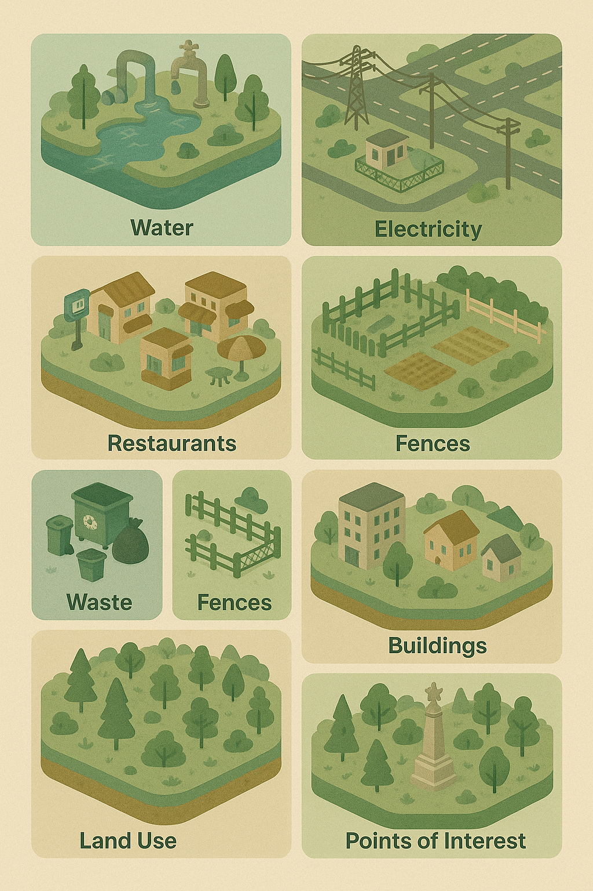
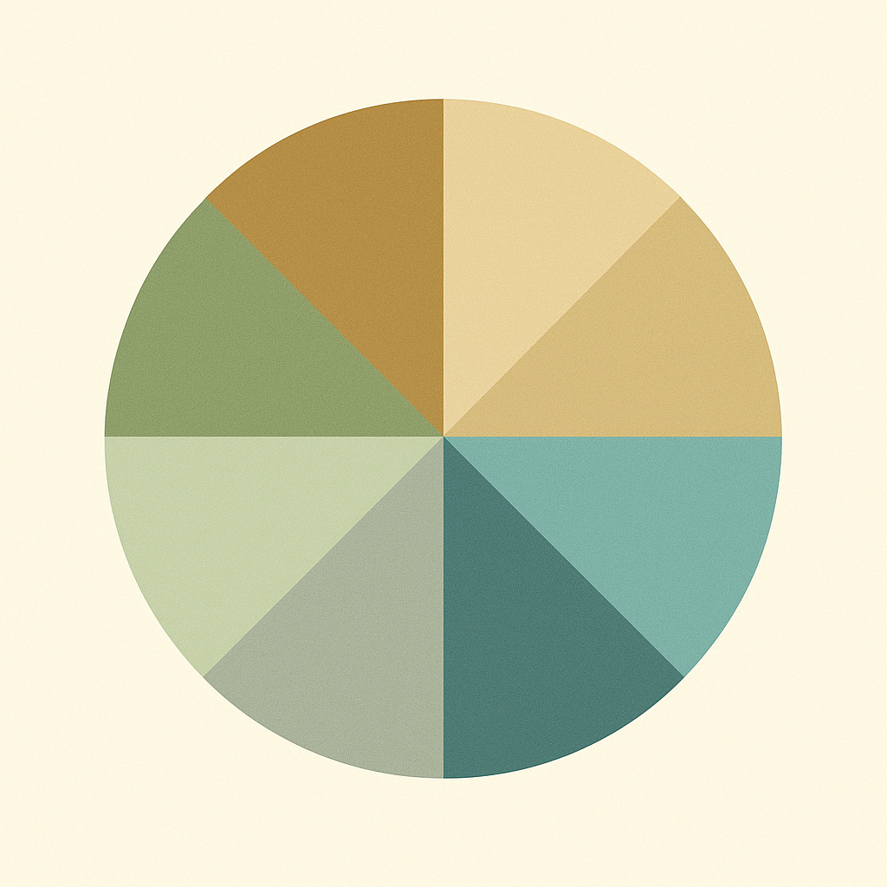
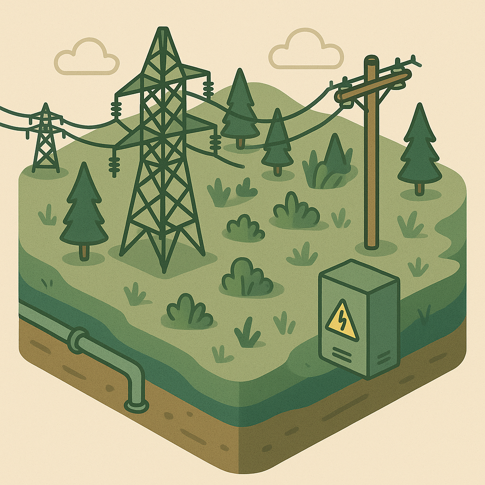
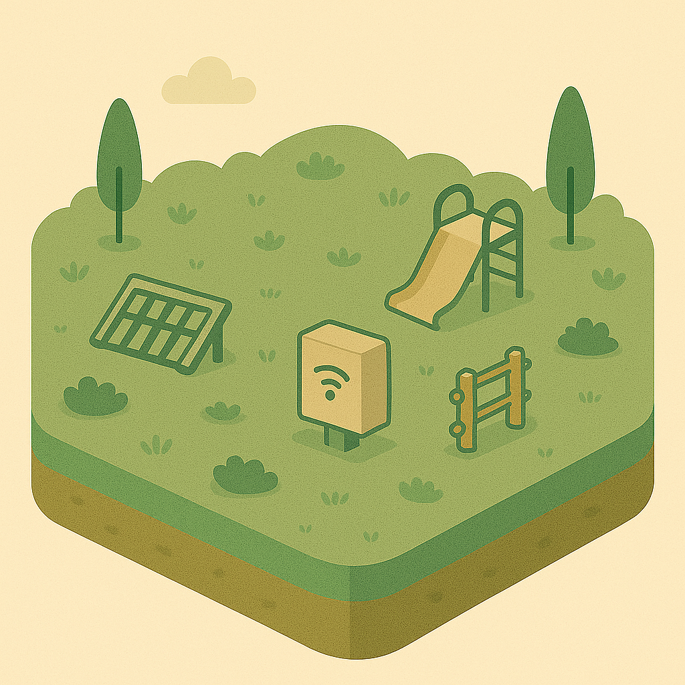
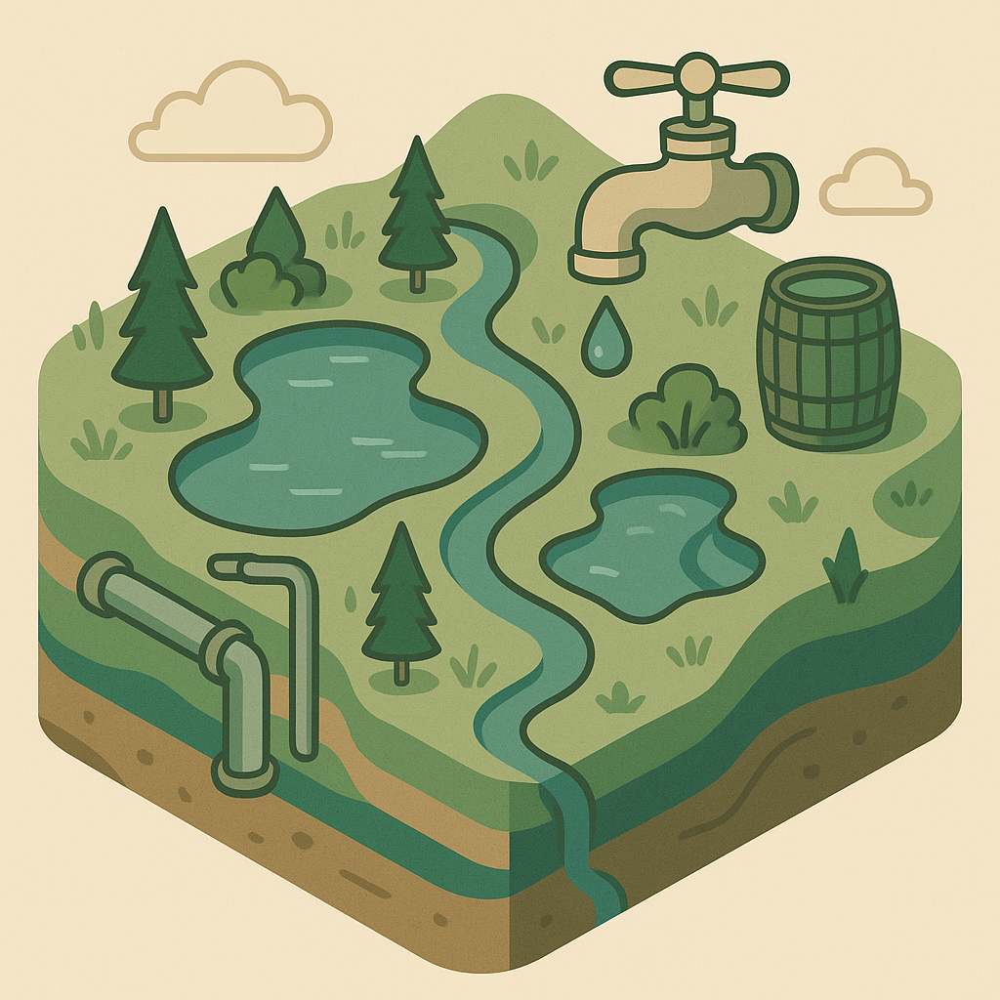
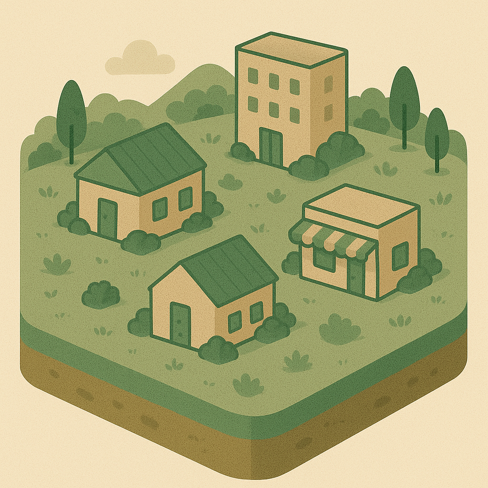
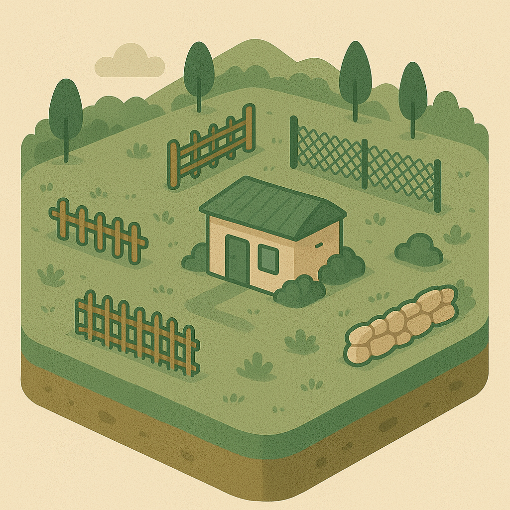

# 🌐 Infrastructure Mapper


Welcome to **Infrastructure Mapper**! This repository contains guidelines and conventions for a spatial database intended to be used managing infrastructure-related data.

---

## 📖 Table of Contents

- [🌐 Infrastructure Mapper](#-infrastructure-mapper)
  - [📖 Table of Contents](#-table-of-contents)
  - [🚀 Project Overview](#-project-overview)
  - [📂 Folder Structure](#-folder-structure)
  - [🤖 Using 'AI' (Large Language Models)](#-using-ai-large-language-models)
  - [🌿 Design Aesthetic](#-design-aesthetic)
  - [Data Model](#data-model)
    - [⚡ Electricity](#-electricity)
    - [🏗️ Infrastructure](#️-infrastructure)
    - [💧 Water](#-water)
    - [🌱 Vegetation](#-vegetation)
    - [📡 Monitoring](#-monitoring)
    - [🏠 Buildings](#-buildings)
    - [🚧 Fencing](#-fencing)
    - [📍 Points Of Interest](#-points-of-interest)
    - [🗺️ Landuse](#️-landuse)
    - [🚪 Gates](#-gates)
    - [🪧 Poles](#-poles)
    - [🍽️ Culinary](#️-culinary)
    - [🛣️ Roads](#️-roads)
  - [📜 License](#-license)
  - [⚒️ Using](#️-using)
  - [🧊 Using the Nix Flake](#-using-the-nix-flake)
  - [✨ Contributing](#-contributing)
  - [📧 Contact](#-contact)
  - [Contributors](#contributors)

---

## 🚀 Project Overview


[](https://github.com/kartoza/InfrastructureMapper/actions/workflows/SQLLintAndLoad.yml)ccccccteberftebhjbtehlfekiiiercudrhjbguiuvke

This project consists of:

1. a [SQL Schema](sql/schema.README.md) for PostgreSQL,
2. a set of fixtures to load that schema with default values (particularly for lookup tables)
3. a set of QGIS forms and layer styles for visualising the data

## 📂 Folder Structure

```plaintext
InfrastructureMapper/
├── img/               # Images and media resources used in this documentation
├── qml/               # QGIS layer style and form definitions
├── diagrams/          # Documentation and ERD diagrams
├── sql/               # Chema and fixtures to load into postgres
├── tests/             # Unit tests and test cases
└── README.md          # Project overview and conventions
```

---

## 🤖 Using 'AI' (Large Language Models)

We are fine with using LLM's and Generative Machine Learning to act as general assistants, but the following three guidelines should be followed:

1. **Repeatability:** Although we understand that repeatability is not possible generally, whenever you are verbatim using LLM or Generative Machine Learning outputs in this project, you **must** also provide the prompt that you used to generate the resource.
2. **Declaration:** Sharing the prompt above is implicit declaration that a machine learning assistent was used. If it is not obvious that a piece of work was generated, include the robot (🤖) icon next to a code snippet or text snippet.
3. **Validation:** Outputs generated by a virtual assistent should always be validated by a human and you, as contributor, take ultimate responsibility for the correct functionality of any code and the correct expression in any text or media you submit to this project.

---

## 🌿 Design Aesthetic



Our design aesthetic is an isometric style with a nature and environment inspired palette. We use an the color palette in the table below. The design approach can be personified by:

- Clean vector isometric projection
- Layered terrain with shadows
- Gentle color blending without gradients
- Minimal outlines for clarity
- Selective use of texture (like grass patterns or water ripples)

You can use the notes above and the table below if you are prompt engineering additional graphics for this project using tools like ChatGPT.

Our colour swatch looks like this:



| Name               | Hex      | Use Case                  | Preview                |
|--------------------|----------|---------------------------|------------------------|
| Forest Green       | `#2F5D50`| Dominant vegetation tone  | <span style="display:inline-block;min-width:90px;padding:2px 8px;background:#f5f5f5;border-radius:4px;"><span style="color:#2F5D50;font-weight:bold;">#2F5D50</span></span> |
| Moss Green         | `#7C9C75`| Soft background greenery  | <span style="display:inline-block;min-width:90px;padding:2px 8px;background:#f5f5f5;border-radius:4px;"><span style="color:#7C9C75;font-weight:bold;">#7C9C75</span></span> |
| Earth Brown        | `#A9825A`| Soil, tree bark           | <span style="display:inline-block;min-width:90px;padding:2px 8px;background:#f5f5f5;border-radius:4px;"><span style="color:#A9825A;font-weight:bold;">#A9825A</span></span> |
| Sandstone Beige    | `#E0D2B2`| Pathways, terrain shading | <span style="display:inline-block;min-width:90px;padding:2px 8px;background:#f5f5f5;border-radius:4px;"><span style="color:#E0D2B2;font-weight:bold;">#E0D2B2</span></span> |
| Sky Blue           | `#A4DDED`| Sky, water elements       | <span style="display:inline-block;min-width:90px;padding:2px 8px;background:#f5f5f5;border-radius:4px;"><span style="color:#A4DDED;font-weight:bold;">#A4DDED</span></span> |
| Deep Teal          | `#2B7A78`| Shadows, water depth      | <span style="display:inline-block;min-width:90px;padding:2px 8px;background:#f5f5f5;border-radius:4px;"><span style="color:#2B7A78;font-weight:bold;">#2B7A78</span></span> |
| Leaf Yellow-Green  | `#C1E1C1`| Highlights on foliage     | <span style="display:inline-block;min-width:90px;padding:2px 8px;background:#f5f5f5;border-radius:4px;"><span style="color:#C1E1C1;font-weight:bold;">#C1E1C1</span></span> |
| Rock Gray          | `#9FA8A3`| Mountains, stones         | <span style="display:inline-block;min-width:90px;padding:2px 8px;background:#f5f5f5;border-radius:4px;"><span style="color:#9FA8A3;font-weight:bold;">#9FA8A3</span></span> |
| Cloud White        | `#F5F5F2`| Clouds, light accents     | <span style="display:inline-block;min-width:90px;padding:2px 8px;background:#f5f5f5;border-radius:4px;"><span style="color:#F5F5F2;font-weight:bold;">#F5F5F2</span></span> |

> 🤖 **Prompt:** Generate me a beautiful circular swatch with these colours. Invent nice unique, human names for each colour:
>
> #7C9C75 #A9825A #E0D2B2 #A4DDED #2B7A78 #C1E1C1 #9FA8A3 #F5F5F2

These colors are soft but grounded, avoiding oversaturation while maintaining a naturalistic feel that suits isometric vector work.

---

## Data Model

This section describes each component of the infrastructure mapper data model. You can also find a complete diagram of the data model in [diagrams/Schema.drawio](./diagrams/Schema_2025.drawio) (image render [here](./diagrams/Schema_2025.png)).

### ⚡ Electricity



The **Electricity** component models electrical infrastructure, including power lines, poles, and transformers. This schema enables the representation of the spatial layout and relationships of electricity distribution elements.

**Entities from `sql/2-electricity.sql`:**

- `power_line_type`: Lookup table for types of power lines (e.g., high voltage, low voltage).
- `power_line`: Represents individual power lines, with geometry and a reference to `power_line_type`.
- `power_pole_type`: Lookup table for types of power poles.
- `power_pole`: Represents individual power poles, with geometry and a reference to `power_pole_type`.
- `transformer`: Represents transformers, with geometry and attributes for capacity and type.

```mermaid
erDiagram
  power_line_type {
    UUID uuid PK
    TEXT name
    TIMESTAMP last_update
    TEXT last_update_by
  }
  power_line {
    UUID uuid PK
    UUID power_line_type_uuid FK
    GEOMETRY geometry
    TEXT name
    TIMESTAMP last_update
    TEXT last_update_by
  }
  power_pole_type {
    UUID uuid PK
    TEXT name
    TIMESTAMP last_update
    TEXT last_update_by
  }
  power_pole {
    UUID uuid PK
    UUID power_pole_type_uuid FK
    GEOMETRY geometry
    TEXT name
    TIMESTAMP last_update
    TEXT last_update_by
  }
  transformer {
    UUID uuid PK
    GEOMETRY geometry
    TEXT name
    INTEGER capacity_kva
    TEXT type
    TIMESTAMP last_update
    TEXT last_update_by
  }

  power_line_type ||--o{ power_line : "has many"
  power_pole_type ||--o{ power_pole : "has many"
  power_line ||--o{ power_pole : "has poles"
  power_pole ||--o{ transformer : "has transformers"
```

### 🏗️ Infrastructure



The **Infrastructure** component defines the core entities for representing general infrastructure elements and their types. It provides a flexible structure for categorizing and storing spatial features that do not fit into more specific categories like buildings or roads.

**Entities from `sql/1-infrastructure.sql`:**

- `infrastructure_type`: Lookup table for different types of infrastructure (e.g., bridge, dam, tower).
- `infrastructure`: Represents individual infrastructure elements, with geometry and a reference to `infrastructure_type`.

```mermaid
erDiagram
  infrastructure_type {
    UUID uuid PK
    TEXT name
    TIMESTAMP last_update
    TEXT last_update_by
  }
  infrastructure {
    UUID uuid PK
    UUID infrastructure_type_uuid FK
    GEOMETRY geometry
    TEXT name
    TIMESTAMP last_update
    TEXT last_update_by
  }

  infrastructure_type ||--o{ infrastructure : "has many"
```

> 🤖 **Prompt:** Add a subsection to ## Components which provides
>
> 1. SubHeading: Electricity
> 2. Image: img/electricity.png
> 3. Text: Summary of the entities in sql/2-electricity.sql
> 4. Mermaid: Diagram of the entities in sql/2-electricity.sql

### 💧 Water



The **Water** component models water-related infrastructure, such as pipelines, tanks, and pumps. This schema enables the representation of the spatial layout and relationships of water distribution and storage elements.

**Entities from `sql/3-water.sql`:**

- `water_pipe_type`: Lookup table for types of water pipes (e.g., main, branch).
- `water_pipe`: Represents individual water pipes, with geometry and a reference to `water_pipe_type`.
- `water_tank_type`: Lookup table for types of water tanks.
- `water_tank`: Represents individual water tanks, with geometry and a reference to `water_tank_type`.
- `water_pump`: Represents pumps, with geometry and attributes for capacity and type.

```mermaid
erDiagram
  water_pipe_type {
    UUID uuid PK
    TEXT name
    TIMESTAMP last_update
    TEXT last_update_by
  }
  water_pipe {
    UUID uuid PK
    UUID water_pipe_type_uuid FK
    GEOMETRY geometry
    TEXT name
    TIMESTAMP last_update
    TEXT last_update_by
  }
  water_tank_type {
    UUID uuid PK
    TEXT name
    TIMESTAMP last_update
    TEXT last_update_by
  }
  water_tank {
    UUID uuid PK
    UUID water_tank_type_uuid FK
    GEOMETRY geometry
    TEXT name
    TIMESTAMP last_update
    TEXT last_update_by
  }
  water_pump {
    UUID uuid PK
    GEOMETRY geometry
    TEXT name
    INTEGER capacity_lph
    TEXT type
    TIMESTAMP last_update
    TEXT last_update_by
  }

  water_pipe_type ||--o{ water_pipe : "has many"
  water_tank_type ||--o{ water_tank : "has many"
  water_pipe ||--o{ water_tank : "feeds"
  water_pipe ||--o{ water_pump : "has pumps"
```

> 🤖 **Prompt:** Add a subsection to ## Components which provides
>
> 1. SubHeading: Water
> 2. Image: img/water.png
> 3. Text: Summary of the entities in sql/3-water.sql
> 4. Mermaid: Diagram of the entities in sql/3-water.sql

### 🌱 Vegetation


The **Vegetation** component models natural and managed vegetation features, such as trees, hedges, and planted areas. This schema supports the representation of individual plants and grouped vegetation, along with their types and spatial characteristics.

**Entities from `sql/4-vegetation.sql`:**

- `vegetation_type`: Lookup table for types of vegetation (e.g., tree, shrub, hedge).
- `vegetation`: Represents individual vegetation features, with geometry and a reference to `vegetation_type`.
- `vegetation_group`: Represents groups or areas of vegetation, such as groves or planted beds.

```mermaid
erDiagram
  vegetation_type {
    UUID uuid PK
    TEXT name
    TIMESTAMP last_update
    TEXT last_update_by
  }
  vegetation {
    UUID uuid PK
    UUID vegetation_type_uuid FK
    GEOMETRY geometry
    TEXT name
    TIMESTAMP last_update
    TEXT last_update_by
  }
  vegetation_group {
    UUID uuid PK
    GEOMETRY geometry
    TEXT name
    TIMESTAMP last_update
    TEXT last_update_by
  }

  vegetation_type ||--o{ vegetation : "has many"
  vegetation_group ||--o{ vegetation : "contains"
```

> 🤖 **Prompt:** Add a subsection to ## Components which provides
>
>1. SubHeading: Vegetation
>2. Image: img/vegetation.png
>3. Text: Summary of the entities in sql/4-vegetation.sql
>4. Mermaid: Diagram of the entities in sql/>4-vegetationsql

### 📡 Monitoring


The **Monitoring** component captures infrastructure monitoring devices and their observations. This schema allows for the representation of sensors (such as weather stations, cameras, or environmental monitors), their types, and the data they collect over time.

**Entities from `sql/5-monitoring.sql`:**

- `monitoring_device_type`: Lookup table for types of monitoring devices (e.g., weather station, camera, sensor).
- `monitoring_device`: Represents individual monitoring devices, with geometry and a reference to `monitoring_device_type`.
- `monitoring_observation`: Stores observations or measurements recorded by monitoring devices, including timestamp, value, and type.

```mermaid
erDiagram
  monitoring_device_type {
    UUID uuid PK
    TEXT name
    TIMESTAMP last_update
    TEXT last_update_by
  }
  monitoring_device {
    UUID uuid PK
    UUID monitoring_device_type_uuid FK
    GEOMETRY geometry
    TEXT name
    TIMESTAMP last_update
    TEXT last_update_by
  }
  monitoring_observation {
    UUID uuid PK
    UUID monitoring_device_uuid FK
    TIMESTAMP observed_at
    TEXT observation_type
    FLOAT value
    TEXT unit
    TIMESTAMP last_update
    TEXT last_update_by
  }

  monitoring_device_type ||--o{ monitoring_device : "has many"
  monitoring_device ||--o{ monitoring_observation : "records"
```

> 🤖 **Prompt**: Add a subsection to ## Components which provides
>
>SubHeading: Monitoring
>Image: img/monitoring.png
>Text: Summary of the entities in sql/5-monitoring.sql
> Mermaid: Diagram of the entities in sql/5-monitoring.sql

### 🏠 Buildings



The **Buildings** component models structures and their related entities. The schema supports different building types, fences, and gates, allowing for detailed representation of built infrastructure and their spatial relationships.

**Entities from `sql/6-buildings.sql`:**

- `building_type`: Lookup table for types of buildings (e.g., residential, commercial).
- `building`: Represents individual buildings, with geometry and a reference to `building_type`.
- `fence_type`: Lookup table for types of fences.
- `fence`: Represents individual fences, with geometry and a reference to `fence_type`.
- `gate`: Represents gates, which may be associated with buildings or fences.

```mermaid
erDiagram
    building_type {
        UUID uuid PK
        TEXT name
        TIMESTAMP last_update
        TEXT last_update_by
    }
    building {
        UUID uuid PK
        UUID building_type_uuid FK
        GEOMETRY geometry
        TEXT name
        TIMESTAMP last_update
        TEXT last_update_by
    }
    fence_type {
        UUID uuid PK
        TEXT name
        TIMESTAMP last_update
        TEXT last_update_by
    }
    fence {
        UUID uuid PK
        UUID fence_type_uuid FK
        GEOMETRY geometry
        TEXT name
        TIMESTAMP last_update
        TEXT last_update_by
    }
    gate {
        UUID uuid PK
        GEOMETRY geometry
        TEXT name
        TIMESTAMP last_update
        TEXT last_update_by
    }

    building_type ||--o{ building : "has many"
    fence_type ||--o{ fence : "has many"
    building ||--o{ gate : "has gates"
    fence ||--o{ gate : "has gates"
```

> 🤖 **Prompt:** Add a subsection to ## Components which provides
>
> 1. SubHeading: Buildings
> 2. Image: img/buildings.png
> 3. Text: Summary of the entities in sql/6-buildings.sql
> 4. Mermaid: Diagram of the entities in sql/6-buildings.sql

### 🚧 Fencing



The **Fencing** component models boundary and enclosure features, such as fences and gates, that are not directly associated with buildings. This schema allows for the representation of different fence types, individual fence segments, and standalone gates, supporting detailed mapping of property boundaries and access points.

**Entities from `sql/7-fencing.sql`:**

- `fence_type`: Lookup table for types of fences (e.g., wire, wall, hedge).
- `fence`: Represents individual fence segments, with geometry and a reference to `fence_type`.
- `gate`: Represents gates, with geometry and attributes for name and access type.

```mermaid
erDiagram
  fence_type {
    UUID uuid PK
    TEXT name
    TIMESTAMP last_update
    TEXT last_update_by
  }
  fence {
    UUID uuid PK
    UUID fence_type_uuid FK
    GEOMETRY geometry
    TEXT name
    TIMESTAMP last_update
    TEXT last_update_by
  }
  gate {
    UUID uuid PK
    GEOMETRY geometry
    TEXT name
    TEXT access_type
    TIMESTAMP last_update
    TEXT last_update_by
  }

  fence_type ||--o{ fence : "has many"
  fence ||--o{ gate : "has gates"
```

> 🤖 **Prompt:** Add a subsection to ## Components which provides
>
> SubHeading: Fencing
> Image: img/fencing.png
> Text: Summary of the entities in sql/7-fencing.sql
> Mermaid: Diagram of the entities in sql/7-fences.sql

### 📍 Points Of Interest


The **Points Of Interest (POI)** component models notable locations or features that are relevant for mapping and analysis but do not fit into other infrastructure categories. This schema supports categorizing POIs, storing their spatial locations, and associating descriptive information.

**Entities from `sql/8-poi.sql`:**

- `poi_type`: Lookup table for different types of points of interest (e.g., landmark, facility, service).
- `poi`: Represents individual points of interest, with geometry, a reference to `poi_type`, and descriptive attributes.

```mermaid
erDiagram
  poi_type {
    UUID uuid PK
    TEXT name
    TIMESTAMP last_update
    TEXT last_update_by
  }
  poi {
    UUID uuid PK
    UUID poi_type_uuid FK
    GEOMETRY geometry
    TEXT name
    TEXT description
    TIMESTAMP last_update
    TEXT last_update_by
  }

  poi_type ||--o{ poi : "has many"
```

> 🤖 **Prompt:** Add a subsection to ## Components which provides
>
>1. SubHeading: Points Of Interest
>2. Image: img/point-of-interest.png
>3. Text: Summary of the entities in sql/8-poi.sql
>4. Mermaid: Diagram of the entities in sql/8-poi.sql
>

### 🗺️ Landuse


The **Landuse** component models how land parcels are utilized or designated, such as agricultural, residential, commercial, or conservation areas. This schema enables the representation of landuse types and individual landuse polygons, supporting spatial analysis and planning.

**Entities from `sql/9-landuse.sql`:**

- `landuse_type`: Lookup table for different landuse categories (e.g., agricultural, residential, industrial).
- `landuse`: Represents individual landuse areas, with geometry and a reference to `landuse_type`.

```mermaid
erDiagram
  landuse_type {
    UUID uuid PK
    TEXT name
    TIMESTAMP last_update
    TEXT last_update_by
  }
  landuse {
    UUID uuid PK
    UUID landuse_type_uuid FK
    GEOMETRY geometry
    TEXT name
    TIMESTAMP last_update
    TEXT last_update_by
  }

  landuse_type ||--o{ landuse : "has many"
```

> 🤖 **Prompt:** Add a subsection to ## Components which provides
>
>1. SubHeading: Landuse
>2. Image: img/landuse.png
>3. Text: Summary of the entities in sql/9-landuse.sql
>4. Mermaid: Diagram of the entities in sql/9-landuse.sql

### 🚪 Gates


The **Gates** component models access points within the infrastructure, such as entry or exit gates for properties, facilities, or enclosures. This schema supports different gate types, their spatial locations, and attributes like access control or association with fences or buildings.

**Entities from `sql/10-gates.sql`:**

- `gate_type`: Lookup table for types of gates (e.g., pedestrian, vehicle, automated).
- `gate`: Represents individual gates, with geometry, a reference to `gate_type`, and attributes such as name and access type.

```mermaid
erDiagram
  gate_type {
    UUID uuid PK
    TEXT name
    TIMESTAMP last_update
    TEXT last_update_by
  }
  gate {
    UUID uuid PK
    UUID gate_type_uuid FK
    GEOMETRY geometry
    TEXT name
    TEXT access_type
    TIMESTAMP last_update
    TEXT last_update_by
  }

  gate_type ||--o{ gate : "has many"
```

> 🤖 **Prompt:** Add a subsection to ## Components which provides
>
>SubHeading: Gates
>Image: img/gates.png
>Text: Summary of the entities in sql/10-gates.sql
>Mermaid: Diagram of the entities in sql/10-gates.sql
>
### 🪧 Poles


The **Poles** component models standalone poles used for various infrastructure purposes, such as lighting, signage, or utility support. This schema allows for categorizing pole types and recording individual pole features with their spatial locations and relevant attributes.

**Entities from `sql/11-poles.sql`:**

- `pole_type`: Lookup table for different types of poles (e.g., lighting, signage, utility).
- `pole`: Represents individual poles, with geometry, a reference to `pole_type`, and descriptive attributes.

```mermaid
erDiagram
  pole_type {
    UUID uuid PK
    TEXT name
    TIMESTAMP last_update
    TEXT last_update_by
  }
  pole {
    UUID uuid PK
    UUID pole_type_uuid FK
    GEOMETRY geometry
    TEXT name
    TEXT description
    TIMESTAMP last_update
    TEXT last_update_by
  }

  pole_type ||--o{ pole : "has many"
```

> 🤖 **Prompt:** Add a subsection to here which has:
>
>1. SubHeading: Poles
>2. Image: img/poles.png
>3. Text: Summary of the entities in sql/11-poles.sql
>4. Mermaid: Diagram of the entities in sql/11-poles.sql

### 🍽️ Culinary


The **Culinary** component models food service infrastructure, such as kitchens, dining areas, and food storage facilities. This schema enables the representation of culinary-related spaces, their types, and their spatial relationships within the infrastructure.

**Entities from `sql/12-culinary.sql`:**

- `culinary_facility_type`: Lookup table for types of culinary facilities (e.g., kitchen, canteen, pantry).
- `culinary_facility`: Represents individual culinary facilities, with geometry and a reference to `culinary_facility_type`.
- `food_storage`: Represents food storage areas, with geometry and attributes for capacity and type.

```mermaid
erDiagram
  culinary_facility_type {
    UUID uuid PK
    TEXT name
    TIMESTAMP last_update
    TEXT last_update_by
  }
  culinary_facility {
    UUID uuid PK
    UUID culinary_facility_type_uuid FK
    GEOMETRY geometry
    TEXT name
    TIMESTAMP last_update
    TEXT last_update_by
  }
  food_storage {
    UUID uuid PK
    GEOMETRY geometry
    TEXT name
    INTEGER capacity_kg
    TEXT storage_type
    TIMESTAMP last_update
    TEXT last_update_by
  }

  culinary_facility_type ||--o{ culinary_facility : "has many"
  culinary_facility ||--o{ food_storage : "contains"
```

> 🤖 **Prompt:** Add a subsection to here which has:
>
>1. SubHeading: Culinary
>2. Image: img/food-services.png
>3. Text: Summary of the entities in sql/12-culinary.sql
>4. Mermaid: Diagram of the entities in sql/12-culinary.sql

### 🛣️ Roads


The **Roads** component models transportation infrastructure, including roads, tracks, and paths within the mapped area. This schema enables the representation of different road types, individual road segments, and their spatial characteristics, supporting navigation, planning, and analysis.

**Entities from `sql/13-roads.sql`:**

- `road_type`: Lookup table for types of roads (e.g., main road, track, footpath).
- `road`: Represents individual road segments, with geometry and a reference to `road_type`.
- `road_junction`: Represents intersections or junctions between roads, with geometry and descriptive attributes.

```mermaid
erDiagram
  road_type {
    UUID uuid PK
    TEXT name
    TIMESTAMP last_update
    TEXT last_update_by
  }
  road {
    UUID uuid PK
    UUID road_type_uuid FK
    GEOMETRY geometry
    TEXT name
    TIMESTAMP last_update
    TEXT last_update_by
  }
  road_junction {
    UUID uuid PK
    GEOMETRY geometry
    TEXT name
    TIMESTAMP last_update
    TEXT last_update_by
  }

  road_type ||--o{ road : "has many"
  road ||--o{ road_junction : "connects to"
```

---

> Add a subsection to here which has:
>
>1. SubHeading: Roads
>2. Image: img/roads.png
>3. Text: Summary of the entities in sql/13-roads.sql
>4. Mermaid: Diagram of the entities in sql/13-roads.sql

## 📜 License

This project is licensed under the **MIT License**. See the [LICENSE](LICENSE) file for details.

---

## ⚒️ Using

Simply take the sql files in the sql folder and load them into postgres.

## 🧊 Using the Nix Flake

You can use the provided `flake.nix` to get a fully reproducible development environment and to run QGIS with the correct profile.

1. **Install [Nix](https://nixos.org/download.html)** (if you haven’t already).
2. **Enter the development shell:**

```bash
nix develop
```

This gives you all the tools and dependencies you need for working on this project.

1. **Run QGIS with the project profile:**

```bash
  nix run .#qgis
```

Or, for the long-term release version:

```bash
nix run .#qgis-ltr
```

1. **VSCode users:**  

You can launch a ready-to-use VSCode environment:

```bash
./vscode.sh
```

---

This makes it easy to get started and ensures everyone is using the same environment!

## ✨ Contributing

We welcome contributions! Please read the [CONTRIBUTING.md](CONTRIBUTING.md) for guidelines on how to get started.

---

## 📧 Contact

Have questions or feedback? Feel free to reach out!  
📧 Email: [info@kartoza.com](mailto:info@kartoza.com)  
🌐 Website: [kartoza.com](https://kartoza.com)

## Contributors

- [Tim Sutton](https://github.com/timlinux) - project lead
-  

---

Made with ❤️ by Tim Sutton (@timlinux) and Kartoza Interns.
